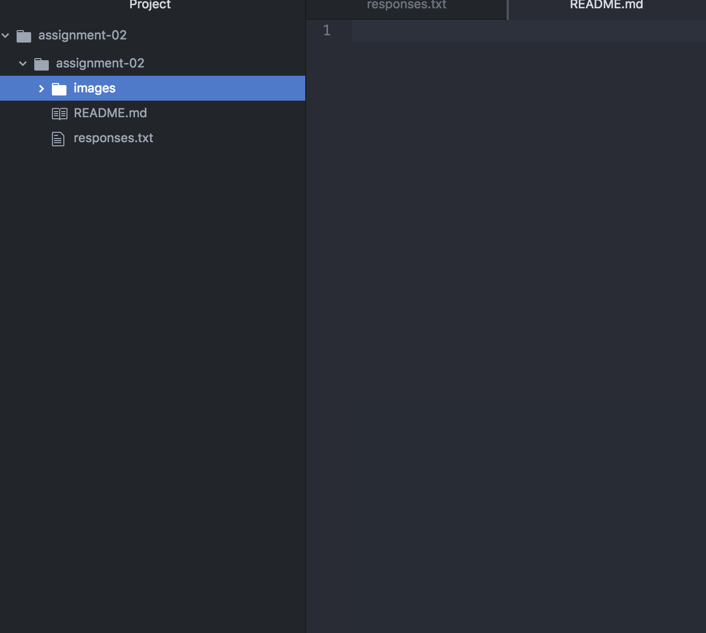

# Assignment 2
## Ryley Siclair

I decided to take this class because I thought it would be a useful tool to have under my belt. It was also very intriguing to me, since I do not know much about web design at all. I thought it would be a good skill to have, especially in this day of age with technology.

I have learned:

- the difference between the web and the internet
- how to create repositories
- how to create directories and subdirectories

[google search](https://www.google.com/)

[my responses file](./responses.txt)

